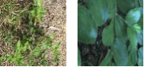

# Polimi - Artificial Neural Networks and Deep Learning

This repository contains my homework solutions for the Artificial Neural Networks and Deep Learning course at Polimi (2022-2023).

## Homework 1

https://codalab.lisn.upsaclay.fr/competitions/8522

The first homework focused on image classification based on a dataset composed of 3542 images featuring eight distinct plant species.
The objective was to train a convolutional neural network to accurately classify new plant images into their respective species.
One of the main issues to overcome was the imbalance in sample sizes across species, with 186 instances for the first and 532 for the second. 
Consequently, various augmentation and oversampling techniques were implemented to address this problem.

Example of augmentation filters applied

## Homework 2

https://codalab.lisn.upsaclay.fr/competitions/9056

The second homework was around time series classification using a dataset consisting of various time series, each composed of six pre-segmented features within windows of 36 measurements. 
The task was to classify these time series into one of the 12 assigned categories.

Upon examining the provided data, an initial observation revealed an imbalance, with the "Sorrow" category having more samples than others, and certain classes like "Breathe" and "Shine" being underrepresented.

To address this, the final model was crafted by creating an ensemble of the best-trained models from various types covered in the course, including 1DCNN, BiLSTM, and Inception.

Samples distribution in the given dataset:

Examples of data extracted from four of the twelve categories:

Final model

